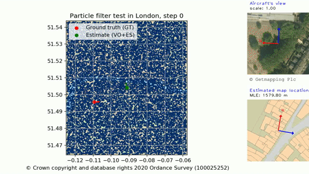

# Image-Map-Embeddings

This repository contains code related to the papers: 
- [1] [You Are Here: Geolocation by Embedding Maps and Images](https://link.springer.com/chapter/10.1007/978-3-030-58592-1_30 "You Are Here: Geolocation by Embedding Maps and Images")
- [2] [Global Aerial Localisation using Image and Map Embeddings](https://ieeexplore.ieee.org/document/9562005 "Global Aerial Localisation using Image and Map Embeddings").

Embeddings             |  Aerial localisation
:-------------------------:|:-------------------------:
  |  

Here we provide:
 - A pytorch implementation of the network used in both papers.
 - Embedded descriptors for each testing area in both papers.
 - Links to download pretrained weights for the networks.
 - Links to download map tiles used in [1].
 - Testing routes used in [2].
 - An implementation of the particle filter used in [2].

### Prerequisites
 - pytorch 
 - torchvision
 - opencv 
 - pandas
 - tensorboard

Please see the "environment.yml" for a detailed list of packages and versions.

Our code has been tested in linux only.
 
### Street model
#### Data sets and preparation
 - For experiments in [1] we used the StreetLearn data set. To request it please visit the [StreetLearn](https://sites.google.com/view/streetlearn/dataset "StreetLearn Dataset") webpage.
 - To download map tiles go to [tiles](https://drive.google.com/drive/folders/18FhEbizGtayA7AqqN2X6Lh_X5F-4wIoP?usp=sharing "Tiles").
 - If you wish to generate your own map tiles, this repository may be helpful: [docker-cvloc repository](https://github.com/0b3d/docker-cvloc "docker-cvloc")
 - The code expects data to be in the following directory structure:
 ``` 
 dataroot\
 ├── jpegs_manhattan_2019
 |   ├── nodes.txt
 |   ├── links.txt
 |   ├── panorama1.jpg
 |   ├── panorama2.jpg
 ├── jpegs_pittsburgh_2019
 |   ├── nodes.txt
 |   ├── links.txt
 |   ├── panorama1.jpg
 |   ├── panorama2.jpg
 ├── tiles_manhattan_2019
 |   ├── z18
 |   |   ├── 00000.png
 |   |   ├── 00001.png    
 |   ├── z19
 |   |   ├── 00000.png
 |   |   ├── 00001.png
 ├── tiles_pittsburgh_2019
 |   ├── z18
 |       ├── 00000.png
 |       ├── 00001.png
 |   ├── z19
 |       ├── 00000.png
 |       ├── 00001.png
 ``` 
  Note: z18 and z19 refer to OSM zoom levels covering an area around 152x152 m² and 76x76 m² respectively (i.e. the size of a map tile at the equator). In [1] we refer to zoom 18 and 19 as scale S1 and S2, respectively.
  
  - Once you get the StreetLearn, data please run the command below. It will read "nodes.txt" files and use them to populate the required tables in our implementation.
 ```
 python populate_streetlearn.py <streetlearn_dataroot_path>
 ```
 
 #### Using pretrained weights for inference
 To predict descriptors for a particular area using the pretrained network please follow these steps: 
 1. Download the pretrained weights from [Weights](https://drive.google.com/drive/folders/18FhEbizGtayA7AqqN2X6Lh_X5F-4wIoP?usp=sharing "Weights")
 2. Create a directory named checkpoints in the path of your preference
 3. Inside checkpoints directory, create a subdirectory named *street_model_pretrained*
 4. Copy and paste the pretrained weights in the *street_model_pretrained* folder
 5. Predict descriptors running the command below. Essential configuration flags are shown in the mentioned script. For a complete list of options please check the code.
 ```
 ./scripts/predict_street.sh
 ```
 6. Predictions will be saved in the results directory
 
 #### Training street model
 
 - To train the network yourself use the command below. Essential configuration options are shown in the script. For a complete list of options please check the code.
 ```
 ./scripts/train_street.sh
 ```
 #### Plotting recall and retrieving examples
 - To produce a recall plot configure and run 
 ```
 ./scripts/plot_recall_street.sh
 ```
 - To show retrieved map tiles given a query image, you can run 
 ```
 ./scripts/retrieve_examples_street.sh
 ```
#### Localisation
- For The implementation of the algorithm described in [1], please refer to [you-are-here repository](https://github.com/ZhouMengjie/you-are-here "this repository").

### Aerial model
#### Data sets and preparation
 - For experiments in [2] we used the mastermap from the Ordnance Survey and aerial imagery from Getmapping Plc in the UK. Data is under copyright and therefore we do not provide it here. However, data sets can be accessed through Digimap services [Digimap](https://digimap.edina.ac.uk/ "Digimap") after subscription. 
 - We have prepared a file with the instructions to download and prepare the data here: [prepare_aerial_data](aerial/prepare_data.md).
 - For a specific list of geographic areas used in our experiments please refer to [2].

 #### Using pretrained weights for inference
 To predict descriptors for a particular area using the pretrained network please follow these steps: 
 1. Download the pretrained weights using the following link. [Weights](https://drive.google.com/drive/folders/18FhEbizGtayA7AqqN2X6Lh_X5F-4wIoP?usp=sharing "Weights")
 2. Create a directory named checkpoints in the path of your preference
 3. Inside checkpoints directory, create a subdirectory named *aerial_model_pretrained*
 4. Copy and paste the pretrained weights in the *aerial_model_pretrained* folder
 5. Predict descriptors using script below. Essential configuration flags are shown in the script. For a complete list of options please check the code.
 ```
 ./scripts/predict_aerial.sh
 ```
 6. Predictions will be saved in the results directory
 
 #### Training aerial model
 
 - To train the network yourself configure and run the command below. Essential configuration flags are shown in the script. For a complete list of options please check the code.
 ```
 ./scripts/train_aerial.sh
 ```
  
 #### Plotting recall and retrieving examples
 - To plot recall configure and run 
 ```
 ./scripts/plot_recall_aerial.sh
 ``` 
 - To visualize top-k retrieved map tiles given a query aerial image use the command below
 ```
 ./scripts/retrieve_example_aerial.sh
 ```
 #### Localisation
- There are 100 testing trajectories in each of the testing cities (London, Oxford and Bristol).
- To run the particle filter configure and execute the script 
```
./scripts/localize_aerial.sh
```
- To run filter on specific trajectories specify their indices after the option trial, i.e. ```--trial index1 index2```. Otherwise it will run over the complete set of trajectories.
- To visualize a map with particles, ground truth and estimated position include the flag ```--visualize```

### Disclaimer

We make no claims about the stability or usability of the code provided in this repository.
We provide no warranty of any kind, and accept no liability for damages of any kind that result from the use of this code

### Citation

If you use our implementation please cite the relevant paper.
```latex
@inproceedings{samano2020you,
  title={You Are Here: Geolocation by Embedding Maps and Images},
  author={Samano, Noe and Zhou, Mengjie and Calway, Andrew},
  booktitle={European Conference on Computer Vision},
  pages={502--518},
  year={2020},
  organization={Springer}
}

@inproceedings{samano2021global,
  title={Global Aerial Localisation Using Image and Map Embeddings},
  author={Samano, Noe and Zhou, Mengjie and Calway, Andrew},
  booktitle={2021 IEEE International Conference on Robotics and Automation (ICRA)},
  pages={5788--5794},
  year={2021},
  organization={IEEE}
}
```

You may also be interested in the related work:
```
@INPROCEEDINGS{zhou2021efficient,
  author={Zhou, Mengjie and Chen, Xieyuanli and Samano, Noe and Stachniss, Cyrill and Calway, Andrew},
  booktitle={2021 IEEE/RSJ International Conference on Intelligent Robots and Systems (IROS)}, 
  title={Efficient Localisation Using Images and OpenStreetMaps}, 
  year={2021},
  pages={5507-5513},
  doi={10.1109/IROS51168.2021.9635972}}

```


 
